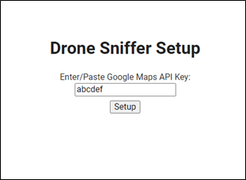
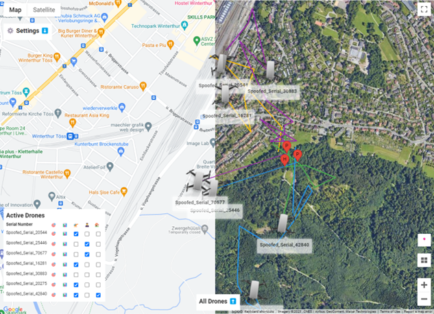
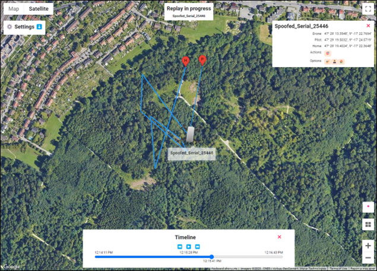

# Drone Remote ID Monitoring System
This repository is the public repository for the Bachelor Thesis on a "Building an Accessible and Affordable Drone Monitoring System Based on drone Remote ID". It contains code and documents related to the web application developed as part of this bachelor's thesis. The contents are organized as follows:

+ The **Bachelor_Thesis.pdf** is the final report of the project.
+ The **Receiver** folder contains all the code for the developed web application.

This system was developed to monitor drones via Remote IDs. The 
system supports DJI's proprietary format as well as the ASD-STAN format. 
It currently monitors drones via Remote IDs transmitted over Wi-Fi. It is designed to 
be easily extended with additional formats as well as 
sniffing types.

**Disclaimer:** This repository was created by students as part of a Bachelor thesis. It is not meant to be maintained nor updated. It is a  proof of concept and is not intended for production use. The authors do not take any responsibility or liability for the use of the software. Please exercise caution and use at your own risk.


**Note:** A [spoofer program](https://github.com/cyber-defence-campus/droneRemoteID_spoofer),  which is able to spoof fake Remote ID information is kept in a separate repository. The spoofed Remote IDs can be DJI's proprietary format as well as the ASD-STAN format and can be used to test the drone monitoring system in this repository.

## Authors
The work in this project was  done by:
- [Fabia Müller](https://github.com/alessmlr), Zurich University of Applied Sciences
- [Sebastian Brunner](https://github.com/Wernerson),Zurich University of Applied Sciences

and supervised by:
- [Prof. Dr. Marc Rennhard](https://github.com/rennhard),  Zurich University of Applied Sciences
- [Llorenç Romá](https://github.com/llorencroma),  Cyber-Defence Campus
  
## Installation

The system is meant to run in any Linux distribution. We tested it on a Raspberry Pi 4 running a Lite OS 64-bit and on an Ubuntu 22.04. Make sure you have `python` and `pip` installed.

From `Receiver/` folder install the requirements with
```
sudo pip3 install -r ./requirements.txt
```
   (This step requires a working internet connection)

To start the application run the python script (port 80 by default):

```
sudo python3 ./backend/dronesniffer/main.py -p 80
```

This will start the web application on port 80.

The receiver app can also be run at boot time by enabling `dsniffer.service`,  which runs the main python script. To run the service at boot time execute the following command

   ```
    sudo sh install_service.sh
   ```
 
This script copies the receiver files into `/opt/dsniffer/` and enables the service to be run at boot time. 


## Usage

From the browser, access the ip address of the receiver machine on the specified port. Whenever a client browser accesses the application for the first time, a setup view appears (see below), requesting a google maps key ([see how to get you Google Maps API](https://developers.google.com/maps/documentation/javascript/get-api-key)). 

**Note** Some browser might not show the GUI properly. See section **Brower Issues** for known issues.



After the google maps key is accepted a map appears with multiple controls. The 
picture below displays this view (monitor view). To start monitoring, 
a WLAN interface (**with monitor mode capabilities**) has to be chosen via the Settings (in the top left corner) and saved.



Actively monitored drones are listed in the list in the bottom left corner. 
Optionally the flown path of the drone as well as the pilot location 
("P"-pin) and the starting point (home location, "H"-pin). Each drone 
receives its own colour to distinguish the different drones. To display drone details, 
simply click on the drone.

An already completed flight of a drone can be replayed by the "play"-button 
displayed in the metrics data of the drone. This can be opened by either 
clicking on a drone or via the "Active Drones" list and clicking the 
metrics-emoji.




For further instructions please read the [Wiki](https://github.com/cyber-defence-campus/RemoteIDReceiver/wiki) or Section 5.2.2 of [the Bachelor thesis](Bachelor_Thesis_Drone_Monitoring_System.pdf).

## Troubleshooting
### Browser issues
During the tests different clients were tested, including laptops and an iPad Air 4th Generation as well as different browsers which successfully worked. Minor issues were noted:

- Ubuntu laptop running **Mozilla Firefox 103.0.1** did not load the inital view for configuring the Google API.
- iPad running **Safari** showed minor graphic isseus with the drone path.

### Error when installing requirements.txt
With a newer version of `pip` we encountered the following error when running `pip3 install -r requirements.txt`:

`error: externally-managed-environment`

Executing the following command solved it, but we did not investigate further:

`sudo mv /usr/lib/python3.11/EXTERNALLY-MANAGED /usr/lib/python3.11/EXTERNALLY-MANAGED.old`
