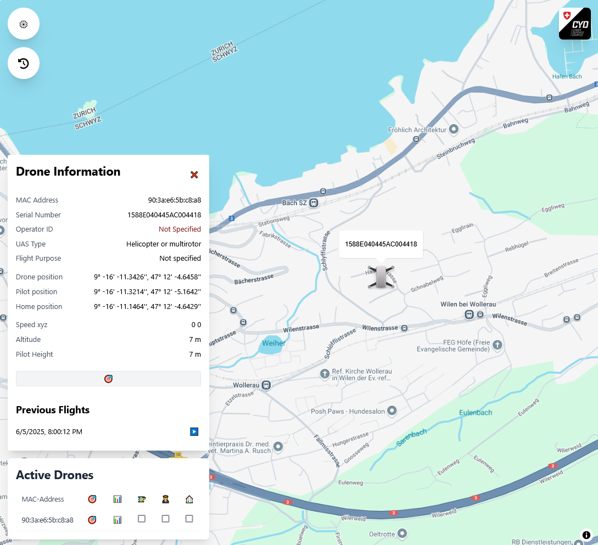
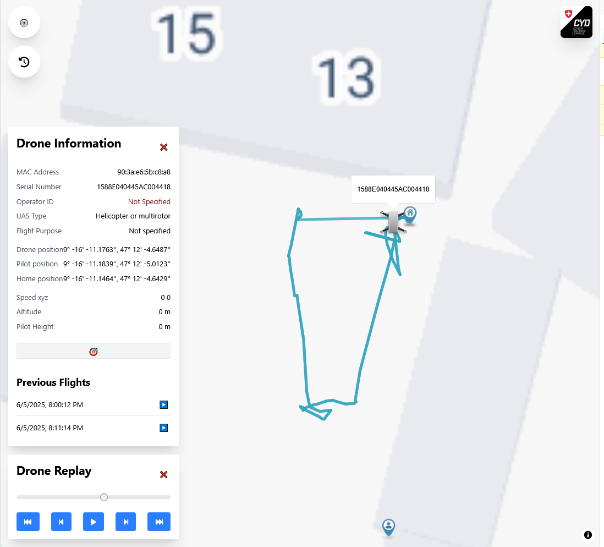

# 🛰️ Drone Remote ID Monitoring System

This repository introduces an extended **Remote ID Monitoring Platform** developed as part of a bachelor thesis at the **Lucerne University of Applied Sciences and Arts**, in collaboration with the **Cyber Defence Campus**. The system enables offline-capable, real-time and replayable monitoring of civilian drone broadcasts via WiFi as required under the **ASD-STAN prEN 4709-002** standard.

The project builds on the original [Remote ID Receiver](https://github.com/cyber-defence-campus/RemoteIDReceiver/tree/legacy-v1), adding full ASD-Stan support, multithreaded performance, and a user-friendly offline mapping frontend.

**Disclaimer:** This repository was created as part of a Bachelor thesis. It is not meant to be maintained nor updated. It is a proof of concept and is not intended for production use. The authors do not take any responsibility or liability for the use of the software. Please exercise caution and use at your own risk.

**Note:** The old version of the app can be found on the [legacy branch](https://github.com/cyber-defence-campus/RemoteIDReceiver/tree/legacy-v1) of this project.
## Project Summary

Modern drones are increasingly required to broadcast identification messages (Remote ID) in open formats over Wi-Fi or Bluetooth. This system captures, decodes, stores, and visualizes such messages using:

- A modular **Python backend** with REST + WebSocket APIs
- A **VueJS-based frontend** with customizable map source (via MapLibre JS)
- Full support for **all ASD-STAN Remote ID message types**
- **Replay mode** for investigating previous drone activities

##  Installation

To install and run the project, please follow the instructions in the official [Receiver/README.md](./Receiver/README.md).

This includes setting up:

- A compatible Wi-Fi adapter in monitor mode 
- Python and NodeJS environments for backend/frontend
- Optional: Hosting your own [TileServer](./Receiver/README_TILESERVER.md) for offline maps

##  Usage

### Monitor Mode

Live view of all currently broadcasting drones, updated in real-time.

### Replay Mode

Reconstruct and analyze past drone broadcasts based on stored data.

## 👥 Authors & Supervision

This project was implemented as part of a **Bachelor thesis** in the BSc AIML program at Lucerne University in collaboration with the Cyber-Defence Campus in Switzerland.

- **Author**: [Sven Fahrni](https://github.com/svenfahrni)
- **Supervisor CYD**: [Llorenç Romá](https://github.com/llorencroma), Cyber Defence Campus
- **Supervisor HSLU**: [Thomas Letsch](https://www.ost.ch/de/person/thomas-letsch-1402)

