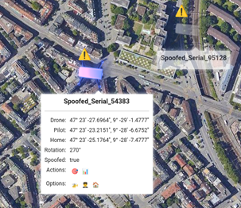

# Drone Remote ID Monitoring System
This repository is the public repository for the Bachelor Thesis on a "Building an Accessible and Affordable Drone Monitoring System Based on Remote ID". It contains code and documents related to the web application developed as part of a bachelor's thesis. The contents are organized as follows:

+ The **Bachelor_Thesis.pdf** is the final report of the project.
+ The **Receiver** folder contains all the code for the developed web application.

This system was developed to monitor drones via Remote IDs. The 
system supports DJI's proprietary format as well as the ASD-STAN format. 
It currently monitors drones via Remote IDs transmitted over Wi-Fi. It is designed to 
be easily extended and can be easily extended by additional formats as well as 
sniffing types.

**Disclaimer:** This repository was created by students as part of a Bachelor thesis. It is not meant to be maintained nor updated.

## Installation on Raspi 4
The system was tested on a Raspberry Pi 4, therefore, installation instructions are provided for this. It is intended to be used any Linux distribution. The installation requires the following:
- a Device to read SD-cards (e.g., Laptop)
- a Raspberry Pi 4
- Raspberry Pi Imager [download link](https://www.raspberrypi.com/software/)
- working internet connection (e.g., WLAN)
- WLAN adapter with promiscous/monitor mode capabilities

**Note:** This installation instruction was written using version 1.7.5 of the 
Raspberry Pi Imager for Windows.

Steps:
1. Start Raspberry Pi Imager
2. Install OS Lite 64 bit on SD-card with the following settings:
   - set hostname: <host>
   - enable ssh (use pw authentication for simplicity)
   - set username and password: <user>, <pw>
   - configure Wireless LAN: <ssid>
   - (optionally) set locale settings: <timezone> and <keyboard layout>
3. Insert SD into Raspberry Pi 4
4. Connect Raspberry Pi 4 to power (compatible power source)
5. Connect your machine to same WLAN as Raspberry Pi 4
6. Connect to Raspberry Pi 4 via ssh 

    (may take afew minutes for raspi to be connected with wlan and be ready)

    ```bash
    ssh <usern>@<host>.local / <pw>
   ```
7. Download code from this Repository
8. Execute install script with

    ```bash
    sudo sh install.sh
   ``` 
   OR make install script executable and run it with 
    ```bash
   sudo ./install.sh
   ``` 
   (This step requires a working internet connection)

After the installation script is through, the application should be 
available via < host >.local in the browser.


## Usage

Whenever a browser accesses the application for the first time, a setup 
view appears (see below), requesting a google maps key.


After the google maps key is accepted a map appears with multipl controls. The 
picture below displays this view (monitor view). To start monitoring, 
an WLAN interface (**with monitor mode capabilities**) has to be chosen via the Settings (in the top left corner) 
and saved. Since it is a google maps beneath, two map options (Regular and 
Satellite) above the Settings are available.


Actively monitored drones are listed in the list in the bottem left corner. 
Optionally the flown path of the drone as well as the pilot location 
("P"-pin) and the starting point (home location, "H"-pin). Each drone 
receives its own colour distinguish the different drones. To display drone details, 
simply click on the drone.

An already completed flight of a drone can be replayed by the "play"-button 
displayed in the metrics data of the drone. This can be opened by either 
clicking on a drone or via the "Active Drones" list and clicking the 
metrics-emoji.


The application has also a built-in spoofing detection mechanism, which 
checks the distance from the pilot to the drone. If it is above 15 km, the 
drone will be marked with an exclamation mark, which can be seen in the 
picture below.



For further instructions please read Section 5.2.2 of [the Bachelor thesis](Bachelor_Thesis_Drone_Monitoring_System.pdf).
