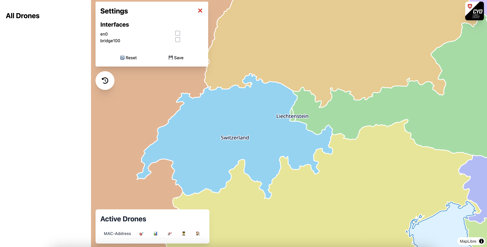

# Drone Monitoring Web Application

A web-based application for monitoring and tracking drones using WiFi and Bluetooth Low Energy (BLE) Remote ID broadcasts. It captures drone telemetry through a WiFi adapter in monitor mode and/or a BlueZ BLE adapter, then displays it on an interactive map.

- [Installation](#installation)
- [Usage](#usage)

## Features
- Real-time drone detection and tracking
- Interactive map visualization
- Support for multiple map services
- Offline capability with self-hosted tile server
- Web-based interface accessible from any device

## Prerequisites
- Docker and Docker Compose
- Python 3.8 or higher
- WiFi adapter with monitor mode support (e.g., [Archer T2U Plus](https://www.tp-link.com/de/home-networking/adapter/archer-t2u-plus/), or EDIMAX EW-7811Un)
- Bluetooth adapter supported by BlueZ (optional, for BLE Remote ID reception)
- Linux-based operating system (for WiFi monitor mode support)
- Sudo privileges (required for monitor mode access)

*Note:  Regular wifi cards often lack support of monitoring-mode. This mode is required to listen to all network traffic. Separate installation of drivers may be needed.*

## Installation

### 1. Clone the Repository
```bash
git clone https://github.com/cyber-defence-campus/RemoteIDReceiver.git

cd Receiver
```

### 2. Install Python Dependencies
```bash
pip install -r requirements.txt
```

*Note: While containerization is possible, direct installation is recommended due to hardware-specific requirements for WiFi monitor mode.*

### 3. Configure the Application
1. Create a configuration file:
```bash
cp .env.example .env
```

2. Configure map service:
- Default: Free map with basic details
- Google Maps: Uncomment `FRONTEND_MAP_STYLE=google` and add your [Google Maps API Key](https://developers.google.com/maps/documentation/javascript/get-api-key). Make sure your API keys are activated and you enabled [Map Tiles API](https://developers.google.com/maps/documentation/tile/cloud-setup#enabling-apis). 
- Self-hosted: Advanced users can configure their own tile server for offline functionality [here](README_TILESERVER.md).

### 4. Build the Frontend
The following command builds your frontend using your configured map.
```bash
docker-compose up build-frontend
```

## Running the Application
You can run the app with:
```bash
sudo python3 ./backend/dronesniffer/main.py -p 80
```
The web interface will be available at `http://localhost:80` (or your specified port).
Documentation of the api will be available at `http://localhost:80/docs` (or your specified port).

*Note: Sudo privileges are required for WiFi monitor mode access.*


### Run as service
<details>
<summary><strong>Details</strong></summary>

### Service Mode (Systemd Service)
1. Start the service:
```bash
sudo systemctl start dsniffer.service
```

2. Stop the service:
```bash
sudo systemctl stop dsniffer.service
```

3. Check service status:
```bash
sudo systemctl status dsniffer.service
```
</details>

### Send RemoteID packets

The Receiver can be tested with the different files in `resources/wifi/send.py`  or by using a [RemoteIDSpoofer](https://github.com/cyber-defence-campus/droneRemoteIDSpoofer).

```
sudo python3 RemoteIDReceiver/Receiver/resources/wifi/send.py -i
<interface name>
```


## Usage
After accessing the app in the browser, the interface that will be used to monitor can be selected from the top left settings menu:

Select Wi-Fi interfaces and/or Bluetooth LE adapters independently. BLE reception passively scans ASTM Remote ID advertisements (service UUID `0xFFFA`); it does not connect to nearby devices or change adapter mode.



### Test Wi-Fi and BLE together

On a Linux receiver, start the application, then select the monitor-mode Wi-Fi adapter and the BLE adapter (for example, `wlan1` and `hci0`) in Settings. The two ingestors run concurrently.

The companion [`droneRemoteIDSpoofer`](https://github.com/cyber-defence-campus/droneRemoteIDSpoofer) repository includes a matching dual-transport scenario:

```bash
cd ../../droneRemoteIDSpoofer
sudo .venv/bin/python3 spoof_drones.py -c scenarios/dual_transport.json
```

Adjust `wlan1` and `hci0` in that scenario to match the transmitter hardware. The receiver decodes both the spoofer's BLE legacy advertisements and its BLE extended message packs, as well as its Wi-Fi beacons.


## Frontend Development

<details>
<summary><strong>Details</strong></summary>

If you want to develop on the frontend, you can spawn a development-server with:
```bash
docker-compose up dev-frontend
```
</details>

## Troubleshooting

### Common Issues
1. **WiFi Adapter Not Working in Monitor Mode**
   - Ensure your adapter supports monitor mode
   - Check if you have the correct drivers installed
   - Verify you're running the application with sudo privileges

2. **Map Not Loading**
   - Verify your internet connection
   - Check if your API key is valid (if using Google Maps)
   - Ensure the frontend was built successfully


## Class Diagrams 
UML Class Diagrams for this project were generated using [Enterprise Architect](https://www.sparxsystems.de/enterprise-architect/) and can be found under [uml_class_diagrams.qea](./uml_class_diagrams.qea).
